# Council — Multi-Agent Deliberation System

The Council is a structured decision-making system for ambitious software projects. Instead of getting a single AI perspective on a design problem, the Council assembles a team of 3-7 specialized agents from a roster of 20 that each bring a distinct lens — architecture, security, UX, mobile, visual design, growth, IoT, AI/LLM, and more — and puts them through a formal deliberation process. The result is a design document and execution plan that has been stress-tested from multiple angles before a single line of code is written.

**The core insight:** a single perspective tends to anchor on its first plausible idea and stop exploring. Multiple independent perspectives, forced to challenge each other, produce designs that survive contact with reality.

---

## Table of Contents

- [Why Use the Council](#why-use-the-council)
- [Quick Start](#quick-start)
- [How a Session Works](#how-a-session-works)
- [The Agent Roster](#the-agent-roster)
- [Understanding the Deliberation Process](#understanding-the-deliberation-process)
- [Department Skills](#department-skills)
- [Session Management](#session-management)
- [What You Get at the End](#what-you-get-at-the-end)
- [When to Use (and Not Use) the Council](#when-to-use-and-not-use-the-council)
- [Customization](#customization)
- [Project Structure](#project-structure)
- [Built On Claude Code](#built-on-claude-code)

---

## Why Use the Council

You're about to build something non-trivial. Maybe it's a new authentication system, a data warehouse, a real-time collaboration feature, or a migration off a legacy platform. You could start coding immediately, but the risk is high: you'll make architectural decisions early that constrain you later, miss edge cases that become expensive bugs, or over-engineer parts that didn't need it while under-investing in parts that did.

The Council is designed for exactly this moment — the gap between "I know what I want to build" and "I know how to build it well."

What it does differently from just asking Claude:

- **Multiple independent perspectives** — Instead of one AI reasoning about security *and* UX *and* performance *and* data modeling all at once, each concern gets a dedicated agent with deep expertise in that domain.
- **Structured conflict** — Agents are explicitly asked to challenge each other. When the Architect wants a new database table, the Strategist can push back on scope. When the Advocate wants a rich UI flow, the Skeptic flags complexity risks. These tensions get resolved, not ignored.
- **Grounded in your actual codebase** — Agents explore your project before deliberating. Their recommendations reference your actual file structure, tech stack, and conventions — not generic best practices.
- **Reproducible artifacts** — Every session produces a design document, decision log, and PRD that live in your repo. You can review them, share them with your team, or hand them off for execution.

---

## Quick Start

### Prerequisites

The Council runs on [Claude Code](https://claude.com/claude-code) with agent teams enabled. Add this to your `settings.json`:

```json
{
  "env": {
    "CLAUDE_CODE_EXPERIMENTAL_AGENT_TEAMS": "1"
  }
}
```

### Your First Session

```
/council "Build a real-time notification system"
```

That's it. The conductor will:
1. Interview you (2-3 rounds of targeted questions)
2. Score and select the most relevant agents
3. Show you the proposed council for approval
4. Run three rounds of deliberation
5. Synthesize a design document and PRD

You can also start interactively:

```
/council
```

This prompts you with "What's the big idea?" and starts the interview from there.

### Resuming and Managing Sessions

```
/council --resume                     # Resume the most recent session
/council --resume <slug>              # Resume a specific session
/council --resume --pick              # Pick from active sessions
/council --list                       # List sessions in this workspace
/council --list --all                 # List sessions across all workspaces
/council --archive <slug>             # Export session to a GitHub issue
/council --cleanup                    # Review and clean stale sessions
/council --status                     # Quick summary
```

---

## How a Session Works

A council session moves through six phases. You're actively involved in Phases 0-2 (providing input, approving the council composition). Phases 3-5 are largely autonomous.

```mermaid
flowchart TD
    classDef userNode fill:#1b4332,color:#d8f3dc,stroke:#2d6a4f
    classDef artifactNode fill:#1c3461,color:#dbe4ff,stroke:#364fc7
    classDef actionNode fill:#3b1f2b,color:#fcc2d7,stroke:#9c36b5

    START(["💡 Your Idea"])

    subgraph P0["⓪  Intake"]
        p0u[/"👤 Answer: 'What's the big idea?'"/]:::userNode
    end

    subgraph P1["①  Interview  ·  2–3 rounds"]
        p1p["Conductor scans your codebase & asks targeted questions"]
        p1u[/"👤 Answer each round — scope, constraints, priorities"/]:::userNode
        p1a[("📄 interview-summary.md")]:::artifactNode
        p1p --> p1u --> p1a
    end

    subgraph P2["②  Assembly  ·  Agent Selection"]
        p2p["20 agents scored by relevance — 3–7 selected"]
        p2u[/"👤 Approve, add, or remove agents from the lineup"/]:::userNode
        p2a[("📄 assembly.md  ·  Team spawned")]:::artifactNode
        p2p --> p2u --> p2a
    end

    subgraph P3["③  Deliberation  ·  3 rounds"]
        p3r1["Round 1 · Position — agents explore codebase independently"]
        p3r2["Round 2 · Challenge — tension pairs challenge each other's designs"]
        p3r3["Round 3 · Converge — agents reconcile and finalize positions"]
        p3u[/"👤 Review key decisions & resolved tensions"/]:::userNode
        p3a[("📄 design.md  ·  decision-log.md")]:::artifactNode
        p3r1 --> p3r2 --> p3r3 --> p3u --> p3a
    end

    subgraph P4["④  Planning"]
        p4p["Conductor synthesizes PRD with user stories & acceptance criteria"]
        p4u[/"👤 Scope review — approve or adjust before execution"/]:::userNode
        p4a[("📄 prd.md  ·  acceptance-contract.md  ·  test-stubs/")]:::artifactNode
        p4p --> p4u --> p4a
    end

    subgraph P5["⑤  Action"]
        p5c{{"Choose execution path"}}:::actionNode
        p5b["🤖 Team Execution\nagents implement the plan"]
        p5r["🚀 /ralf --from-prd\nautonomous execution loop"]
        p5l["🛠 /launch --from-prd\nisolated worktree"]
        p5c --> p5b
        p5c --> p5r
        p5c --> p5l
    end

    START --> P0
    P0 --> P1
    P1 --> P2
    P2 --> P3
    P3 --> P4
    P4 --> P5
```



### Phase 0: Intake

You describe your idea. Be as specific or as vague as you like — the interview will fill in the gaps.

### Phase 1: Interview (2-3 rounds)

The conductor (the main Claude session) interviews you directly. No agents are spawned yet. The conductor has already scanned your project — it knows your tech stack, directory structure, and conventions — so questions are specific to your situation.

Each round targets 3-4 of the 16 perspectives based on relevance. For example, if you're building a feature that handles user PII, the conductor will ask compliance-oriented questions early. If it's a performance-critical feature, it'll dig into load expectations and latency requirements.

After the interview, the conductor writes a structured summary with relevance scores for each perspective.

### Phase 2: Assembly (Agent Selection)

Each of the 20 agents is scored (0-10) based on keyword matches from the interview, semantic relevance, and mandatory bonuses (e.g., the Architect always gets +2 for new functionality, the Guardian gets +2 for features handling user data).

The conductor shows you the proposed council with scores and rationale. You can approve, add an agent, remove one, or restart the interview.

Typically 3-7 agents are selected. Not every session needs every perspective — a straightforward internal tool might only need the Architect, Craftsman, and Operator, while a cross-platform mobile feature handling sensitive data might assemble seven agents including the Advocate, Pathfinder, Skeptic, and Guardian.

### Phase 3: Deliberation (3 rounds)

This is where the magic happens. Each selected agent is spawned as a separate Claude Code session with its own context window, persona, and cognitive framework.

**Round 1 — Position:** Every agent simultaneously explores your codebase and writes their position statement. The Architect proposes a system design. The Skeptic identifies risks. The Advocate maps the user journey. Each writes independently, grounded in your actual code.

**Round 2 — Challenge:** The conductor identifies 2-4 tension pairs — agents whose positions conflict or create interesting trade-offs — and sends each agent their counterpart's position to respond to. This is where the Architect's "add a new table" gets challenged by the Strategist's "can we do this without new infrastructure?" and genuine design trade-offs get surfaced.

**Round 3 — Converge:** Every agent reads the challenge-round exchanges and writes their final position: what they're sticking with, what concessions they're making, and what they refuse to compromise on.

### Phase 4: Planning

The conductor synthesizes all final positions into a unified design document, resolves remaining tensions, and produces a PRD with user stories and acceptance criteria.

### Phase 5: Action

You choose how to execute:
- **Team execution** — The council agents implement the plan themselves
- **Ralf handoff** — The PRD goes to `/ralf` for autonomous execution
- **Launch handoff** — The PRD goes to `/launch` in a separate worktree
- **Review first** — Read everything before deciding

---

## The Agent Roster

The Council has 20 agents plus a Steward (Maestro) facilitator persona. Each session uses 3-7 of them, selected for relevance.

| # | Agent | Color | What They Care About | When They're Selected |
|---|-------|-------|---------------------|----------------------|
| 1 | [**Architect**](architect/DEPARTMENT.md) | Blue | System design, APIs, data models, integration patterns | Almost always — gets +2 for any new functionality |
| 2 | [**Advocate**](advocate/DEPARTMENT.md) | Green | User experience, product thinking, accessibility | Any user-facing feature — gets +2 mandatory bonus |
| 3 | [**Skeptic**](skeptic/DEPARTMENT.md) | Red | Risk, security, failure modes, devil's advocate | Auth/security work — gets +2 mandatory bonus |
| 4 | [**Craftsman**](craftsman/DEPARTMENT.md) | Purple | Testing strategy, DX, code quality, patterns | Complex features needing test strategy |
| 5 | [**Scout**](scout/DEPARTMENT.md) | Cyan | Research, precedent, library evaluation | Features needing external dependencies or prior art |
| 6 | [**Strategist**](strategist/DEPARTMENT.md) | Gold | Business value, scope, MVP, prioritization | Scope-sensitive or phased rollout features |
| 7 | [**Operator**](operator/DEPARTMENT.md) | Orange | DevOps, deployment, infrastructure, monitoring | Features with non-standard deployment needs |
| 8 | [**Chronicler**](chronicler/DEPARTMENT.md) | Ivory | Documentation, knowledge architecture, onboarding | Features requiring significant docs or ADRs |
| 9 | [**Guardian**](guardian/DEPARTMENT.md) | Silver | Compliance, governance, privacy, audit trails | Features handling user data or PII — gets +2 mandatory bonus |
| 10 | [**Tuner**](tuner/DEPARTMENT.md) | Amber | Performance, scalability, caching, optimization | High-traffic or latency-sensitive features — gets +2 mandatory bonus |
| 11 | [**Alchemist**](alchemist/DEPARTMENT.md) | Indigo | Data engineering, data science, ML, analytics | Data pipelines, warehousing, ML workflows — gets +2 mandatory bonus |
| 12 | [**Pathfinder**](pathfinder/DEPARTMENT.md) | Coral | Mobile, cross-platform, native apps | Mobile/cross-platform features — gets +2 mandatory bonus |
| 13 | [**Artisan**](artisan/DEPARTMENT.md) | Rose | Visual design, design systems, motion | UI-heavy features or design system work — gets +2 mandatory bonus |
| 14 | [**Herald**](herald/DEPARTMENT.md) | Bronze | Growth, monetization, onboarding, retention | User-facing features with growth/monetization implications — gets +2 mandatory bonus |
| 15 | [**Sentinel**](sentinel/DEPARTMENT.md) | Titanium | IoT, embedded, edge, device protocols | IoT/embedded/hardware features — gets +2 mandatory bonus |
| 16 | [**Oracle**](oracle/DEPARTMENT.md) | Violet | AI/LLM integration, RAG, prompt engineering | AI/LLM integration features — gets +2 mandatory bonus |
| 17 | [**Forge**](forge/DEPARTMENT.md) | Graphite | Microarchitecture, silicon design, RTL security, timing, physical implementation | Silicon/hardware security work — gets +2 mandatory bonus |
| 18 | [**Cipher**](cipher/DEPARTMENT.md) | Obsidian | Cryptographic engineering, protocol security, key management, post-quantum readiness | Crypto/protocol security work — gets +2 mandatory bonus |
| 19 | [**Warden**](warden/DEPARTMENT.md) | Slate | OS kernel security, process isolation, privilege boundaries, HW/SW security interface | Kernel/OS security work — gets +2 mandatory bonus |
| 20 | [**Prover**](prover/DEPARTMENT.md) | Pearl | Formal methods, mathematical verification, security invariants, property specification | Formal verification work — gets +2 mandatory bonus |
| — | **Steward** (Maestro) | Platinum | Orchestration, synthesis, facilitation | Always active as conductor persona (not spawned) |

### Reading an Agent Definition

Each agent's definition file (e.g., [`agents/council-architect.md`](../../agents/council-architect.md)) contains:

- **Cognitive Framework** — The mental models the agent uses to reason. The Architect thinks in C4 models and domain-driven design. The Pathfinder thinks in platform conventions and offline-first architecture. The Oracle thinks in cost-latency-quality triangles and evaluation-driven development.
- **Trained Skills** — The specific technical capabilities the agent draws on.
- **Communication Style** — How the agent presents its reasoning. The Architect is precise and structural. The Sentinel is specification-precise and failure-scenario-driven. The Herald is metric-driven and funnel-aware.
- **Decision Heuristics** — 5 core rules the agent follows. These are the agent's "gut instincts" — heuristics like "Start with the data model" (Architect) or "Design for power-off" (Sentinel) or "Start with the eval harness" (Oracle).
- **Known Blind Spots** — What each agent tends to get wrong. The Architect over-engineers for hypothetical futures. The Pathfinder over-invests in offline-first when connectivity is guaranteed. The Artisan over-polishes at the expense of shipping. These self-checks help agents stay grounded.
- **Deliberation Formats** — Templates for Position, Challenge, and Converge rounds that ensure structured, comparable output across agents.

---

## Understanding the Deliberation Process

The three-round deliberation is designed to avoid the two failure modes of group decision-making: **groupthink** (everyone agrees too quickly) and **deadlock** (no one budges).

### Round 1: Position — Independent Exploration

Each agent explores the codebase independently and writes a position with:
- A core recommendation (1-2 sentences)
- A key argument (1 paragraph with specific technical details)
- Risks if their perspective is ignored (2-3 concrete consequences)
- Dependencies on other agents' domains

Because agents work in parallel with separate context windows, there's no anchoring — the Skeptic's threat model isn't influenced by the Architect's system design, and vice versa.

### Round 2: Challenge — Structured Conflict

The conductor reads all positions and identifies **tension pairs**: agents whose recommendations create genuine trade-offs. Examples:

- Architect wants a new table; Strategist says ship without it
- Advocate wants rich interaction; Skeptic flags complexity risk
- Guardian wants full consent flow; Advocate wants frictionless UX
- Tuner wants a caching layer; Architect says premature optimization
- Alchemist wants a full medallion architecture; Strategist says a simple SQL view is enough

Each agent in a tension pair receives their counterpart's position and must respond with: **Maintain**, **Modify**, or **Defer**. This forces explicit engagement with opposing views rather than ignoring them.

Agents not in any tension pair skip this round — there's no value in having the Chronicler challenge the Architect on database schema design.

### Round 3: Converge — Resolution

Every agent reads the challenge exchanges and writes a final position:
- **Revised recommendation** — reflecting any shifts from the debate
- **Concessions made** — what they gave up and why (this is critical for the decision log)
- **Non-negotiables** — what they refuse to compromise on and why
- **Implementation notes** — specific technical details for execution

The conductor synthesizes these final positions into a unified design document with an explicit tension resolution table.

---

## Department Skills

Each agent manages a "department" of 2-3 focused skills. Skills are structured prompt templates with methodology, output format, and quality checks. They produce more rigorous output than freeform reasoning.

### How Skills Are Used

1. **During Assembly** — The conductor matches skill triggers against the idea and interview transcript, selecting 1-2 skills per agent
2. **During Deliberation** — Skill content is inlined into agent prompts. Agents follow the Process steps and include skill-formatted outputs as appendices
3. **During Execution** — Task assignments include relevant skills so agents follow structured methodology

### Skills by Department

| Department | Skills | What They Produce |
|-----------|--------|-------------------|
| [Architect](architect/DEPARTMENT.md) | [codebase-context](architect/codebase-context/SKILL.md), [schema-design](architect/schema-design/SKILL.md), [api-design](architect/api-design/SKILL.md) | Infrastructure analysis, migration-ready schemas, API contracts |
| [Advocate](advocate/DEPARTMENT.md) | [journey-mapping](advocate/journey-mapping/SKILL.md), [interaction-design](advocate/interaction-design/SKILL.md) | User journey maps, component specs with all states |
| [Skeptic](skeptic/DEPARTMENT.md) | [threat-model](skeptic/threat-model/SKILL.md), [failure-mode-analysis](skeptic/failure-mode-analysis/SKILL.md), [edge-case-enumeration](skeptic/edge-case-enumeration/SKILL.md) | STRIDE threat analysis, failure scenarios, edge case catalogs |
| [Craftsman](craftsman/DEPARTMENT.md) | [testing-strategy](craftsman/testing-strategy/SKILL.md), [pattern-analysis](craftsman/pattern-analysis/SKILL.md) | Test plans with coverage targets, codebase pattern audits |
| [Scout](scout/DEPARTMENT.md) | [library-evaluation](scout/library-evaluation/SKILL.md), [competitive-analysis](scout/competitive-analysis/SKILL.md), [technology-radar](scout/technology-radar/SKILL.md) | Library scorecards, feature comparison matrices, tech maturity assessments |
| [Strategist](strategist/DEPARTMENT.md) | [mvp-scoping](strategist/mvp-scoping/SKILL.md), [impact-estimation](strategist/impact-estimation/SKILL.md), [analytics-design](strategist/analytics-design/SKILL.md) | MoSCoW prioritization, RICE scoring, telemetry event plans |
| [Operator](operator/DEPARTMENT.md) | [deployment-plan](operator/deployment-plan/SKILL.md), [observability-design](operator/observability-design/SKILL.md), [cost-analysis](operator/cost-analysis/SKILL.md) | Deployment strategies, monitoring configs, cost models |
| [Chronicler](chronicler/DEPARTMENT.md) | [documentation-plan](chronicler/documentation-plan/SKILL.md), [adr-template](chronicler/adr-template/SKILL.md), [changelog-design](chronicler/changelog-design/SKILL.md) | Doc architecture, ADRs, changelog and migration guides |
| [Guardian](guardian/DEPARTMENT.md) | [compliance-review](guardian/compliance-review/SKILL.md), [data-classification](guardian/data-classification/SKILL.md), [audit-trail-design](guardian/audit-trail-design/SKILL.md) | GDPR reviews, data classification schemes, audit logging designs |
| [Tuner](tuner/DEPARTMENT.md) | [performance-audit](tuner/performance-audit/SKILL.md), [caching-strategy](tuner/caching-strategy/SKILL.md), [load-modeling](tuner/load-modeling/SKILL.md) | Performance baselines, cache hierarchy designs, capacity plans |
| [Alchemist](alchemist/DEPARTMENT.md) | [schema-evaluation](alchemist/schema-evaluation/SKILL.md), [pipeline-design](alchemist/pipeline-design/SKILL.md), [ml-workflow](alchemist/ml-workflow/SKILL.md) | Warehouse schemas, ETL/ELT pipeline architectures, ML workflow designs |
| [Pathfinder](pathfinder/DEPARTMENT.md) | [platform-audit](pathfinder/platform-audit/SKILL.md), [navigation-design](pathfinder/navigation-design/SKILL.md), [device-integration](pathfinder/device-integration/SKILL.md) | Platform compliance reports, navigation architectures, device API integration plans |
| [Artisan](artisan/DEPARTMENT.md) | [visual-audit](artisan/visual-audit/SKILL.md), [design-system-architecture](artisan/design-system-architecture/SKILL.md), [motion-design](artisan/motion-design/SKILL.md) | Visual design critiques, token hierarchies, animation specifications |
| [Herald](herald/DEPARTMENT.md) | [growth-engineering](herald/growth-engineering/SKILL.md), [monetization-design](herald/monetization-design/SKILL.md), [messaging-strategy](herald/messaging-strategy/SKILL.md) | Onboarding funnels, pricing architectures, product messaging frameworks |
| [Sentinel](sentinel/DEPARTMENT.md) | [embedded-architecture](sentinel/embedded-architecture/SKILL.md), [protocol-design](sentinel/protocol-design/SKILL.md), [fleet-management](sentinel/fleet-management/SKILL.md) | Firmware architectures, protocol stack designs, fleet management plans |
| [Oracle](oracle/DEPARTMENT.md) | [prompt-engineering](oracle/prompt-engineering/SKILL.md), [rag-architecture](oracle/rag-architecture/SKILL.md), [ai-evaluation](oracle/ai-evaluation/SKILL.md) | Prompt designs, RAG pipeline architectures, evaluation frameworks |
| [Forge](forge/DEPARTMENT.md) | [microarch-analysis](forge/microarch-analysis/SKILL.md), [rtl-security-review](forge/rtl-security-review/SKILL.md), [physical-design-security](forge/physical-design-security/SKILL.md) | Microarchitecture assessments, RTL security reviews, physical design security audits |
| [Cipher](cipher/DEPARTMENT.md) | [crypto-review](cipher/crypto-review/SKILL.md), [protocol-analysis](cipher/protocol-analysis/SKILL.md), [pqc-readiness](cipher/pqc-readiness/SKILL.md) | Cryptographic reviews, protocol security analysis, post-quantum readiness assessments |
| [Warden](warden/DEPARTMENT.md) | [isolation-review](warden/isolation-review/SKILL.md), [kernel-hardening](warden/kernel-hardening/SKILL.md), [hw-sw-boundary](warden/hw-sw-boundary/SKILL.md) | Process isolation reviews, kernel hardening plans, HW/SW boundary security audits |
| [Prover](prover/DEPARTMENT.md) | [formal-spec](prover/formal-spec/SKILL.md), [invariant-analysis](prover/invariant-analysis/SKILL.md) | Formal specifications, security invariant analysis |

### Skill Evolution

Skills improve over time. After each session, the conductor appends an observation to the skill's Evolution Notes. If a skill consistently needs the same adjustment, its process steps are updated. The [`registry.json`](registry.json) tracks usage across all departments.

---

## Session Management

### Session Artifacts

Every session produces artifacts in your workspace:

```
$WORKSPACE/.claude/council/
  index.json                                    # Per-workspace session index
  sessions/
    <slug>-<YYYYMMDD-HHmm>/                    # Each session isolated
      session.md                                # Phase tracking, loaded skills
      interview-transcript.md                   # Full Q&A record
      interview-summary.md                      # Structured summary with relevance scores
      assembly.md                               # Agent scoring and selection
      deliberation/
        round1/<agent>.md                       # Position statements
        round2/<agent>-responds-to-<other>.md   # Challenge responses
        round3/<agent>.md                       # Final positions
      design.md                                 # Unified design document
      plan.md                                   # Task breakdown
      prd.md                                    # Product requirements document
```

### Archiving

Sessions can be exported to GitHub issues for long-term storage:

```
/council --archive <slug>
```

This creates a GitHub issue with the full design document, interview transcript, deliberation records, and decision log — then optionally cleans up local files.

### Cross-Workspace Tracking

A global registry at `~/.claude/council/global-registry.json` tracks sessions across all your projects. Use `/council --list --all` to see everything.

---

## What You Get at the End

### Design Document

A unified document synthesizing all agents' final positions:
- Architecture (system design, data model, API contracts)
- User experience (journey maps, interaction specs)
- Risk assessment (threat model, failure modes, mitigations)
- Quality strategy (test plan, coverage targets)
- Sections for each agent that participated
- **Tension Resolution table** — exactly which trade-offs were made and why
- **Decision Log** — every significant decision with options considered, choice made, and reasoning

### PRD

A product requirements document with:
- User stories with acceptance criteria
- Quality gates (build, typecheck, lint, test)
- Technical notes (architecture decisions, data model changes, API contracts)
- Dependencies (external services, new packages, migration requirements)

### Task Breakdown

Tasks created and ready for execution, with dependencies set up and agent assignments matching their expertise.

---

## When to Use (and Not Use) the Council

### Use the Council When

- You're designing a **new feature or system** with multiple concerns (data model + API + UI + security)
- You're making **architectural decisions** that will be hard to reverse
- You want to **stress-test a design** before committing to it
- You need to **document decisions** for your team or future self
- The feature involves **multiple domains** (e.g., data engineering + frontend + compliance)

### Don't Use the Council When

- You're fixing a bug (just fix it)
- The task is well-defined and straightforward (use Claude directly)
- You need something done in 5 minutes (a council session takes real time)
- You're making a small, easily reversible change

---

## Customization

### Adding a New Agent

1. Create an agent definition at `agents/council-<name>.md` following the existing pattern (cognitive framework, heuristics, blind spots, deliberation formats)
2. Create a department at `skills/council/<name>/DEPARTMENT.md`
3. Create 2-3 skill directories under the department
4. Add the agent to the roster table in `commands/council.md`
5. Add the department to `skills/council/registry.json`

### Modifying an Agent

Edit the agent's markdown file to adjust their cognitive framework, heuristics, or blind spots. Changes take effect in the next session.

### Adding a Skill

Create a new directory under an agent's department with a `SKILL.md` containing: Purpose, Inputs, Process (step-by-step), Output Format (markdown template), and Quality Checks (verification checklist).

---

## Project Structure

```
agents/
  council-architect.md        # Agent persona definitions (21 files)
  council-advocate.md
  council-skeptic.md
  council-craftsman.md
  council-scout.md
  council-strategist.md
  council-operator.md
  council-chronicler.md
  council-guardian.md
  council-tuner.md
  council-alchemist.md
  council-pathfinder.md
  council-artisan.md
  council-herald.md
  council-sentinel.md
  council-oracle.md
  council-forge.md
  council-cipher.md
  council-warden.md
  council-prover.md
  council-steward.md          # Maestro facilitator persona (not spawnable)

commands/
  council.md                  # The full command specification (orchestration logic)

skills/council/
  README.md                   # This file
  registry.json               # Usage tracking across all departments
  architect/                  # One directory per agent department
    DEPARTMENT.md
    codebase-context/SKILL.md
    schema-design/SKILL.md
    api-design/SKILL.md
  advocate/
    ...
  skeptic/
    ...
  (and so on for all 20 departments)
```

### Key Files to Read

If you want to understand how this works, read these in order:

1. **This README** — The overview you're reading now
2. **[`commands/council.md`](../../commands/council.md)** — The full orchestration specification. This is the conductor's instruction manual and contains all the logic for interviews, scoring, deliberation rounds, and session management.
3. **Any agent file** (e.g., [`agents/council-architect.md`](../../agents/council-architect.md)) — To understand how agent personas are structured
4. **Any SKILL.md** (e.g., [`skeptic/threat-model/SKILL.md`](skeptic/threat-model/SKILL.md)) — To see the structured skill format with process steps and quality checks

---

## Built On Claude Code

The Council is built on primitives provided by [Claude Code](https://claude.com/claude-code) from Anthropic. We want to credit the Anthropic team for building the infrastructure that makes this system possible.

### Core Primitives Used

- **[Agent Teams](https://code.claude.com/docs/en/agent-teams)** — The Council uses agent teams to coordinate multiple Claude Code sessions working in parallel. Each council member is a teammate with its own context window, and the conductor (team lead) orchestrates deliberation rounds, synthesizes findings, and manages the shared task list. The [structured deliberation pattern](https://code.claude.com/docs/en/agent-teams#when-to-use-agent-teams) (Position, Challenge, Converge) maps directly to the "competing hypotheses" use case described in Anthropic's documentation.

- **[Custom Subagents](https://code.claude.com/docs/en/sub-agents)** — Each council member (Architect, Skeptic, Alchemist, etc.) is defined as a custom subagent with a dedicated persona, cognitive framework, and tool access. Agent markdown files in `~/.claude/agents/` give each member a distinct system prompt, model configuration, and behavioral heuristics. The [agent definition format](https://code.claude.com/docs/en/sub-agents#write-subagent-files) (YAML frontmatter + markdown body) is used for all 20 council members plus the Steward facilitator persona.

- **[Skills](https://code.claude.com/docs/en/skills)** — Each council member's department skills (e.g., `schema-evaluation`, `pipeline-design`, `threat-model`) are implemented as Claude Code skills with structured process steps, output formats, and quality checks. Skills are loaded contextually during deliberation based on topic relevance, following the [skill invocation pattern](https://code.claude.com/docs/en/skills#control-who-invokes-a-skill).

- **[Hooks](https://code.claude.com/docs/en/hooks)** — The Council can leverage hooks like [`TeammateIdle`](https://code.claude.com/docs/en/hooks#teammateidle) and [`TaskCompleted`](https://code.claude.com/docs/en/hooks#taskcompleted) to enforce quality gates during deliberation and execution phases.

### Further Reading

| Resource | What You'll Learn |
|----------|-------------------|
| [Agent Teams](https://code.claude.com/docs/en/agent-teams) | How multi-agent coordination works under the hood |
| [When to Use Agent Teams](https://code.claude.com/docs/en/agent-teams#when-to-use-agent-teams) | Use cases, trade-offs vs subagents, and token cost considerations |
| [Custom Subagents](https://code.claude.com/docs/en/sub-agents) | How agent definitions work — frontmatter, tools, permissions, memory |
| [Skills](https://code.claude.com/docs/en/skills) | How structured skills extend agent capabilities |
| [Hooks Reference](https://code.claude.com/docs/en/hooks) | Lifecycle hooks for quality gates and automation |
| [Best Practices](https://code.claude.com/docs/en/agent-teams#best-practices) | Task sizing, avoiding file conflicts, monitoring agents |
